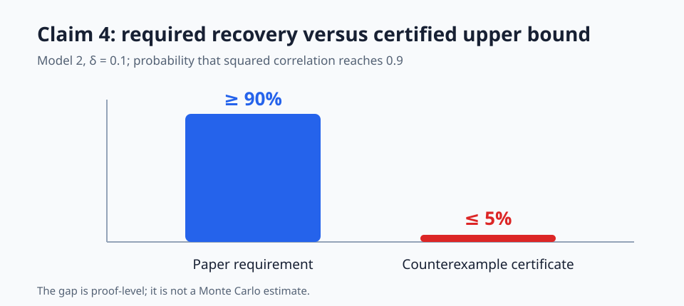
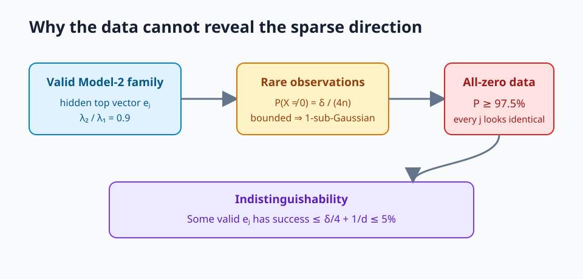
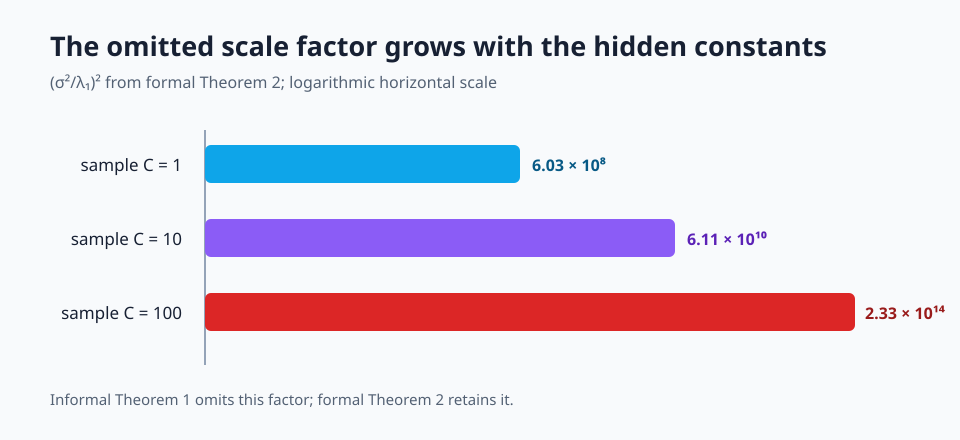
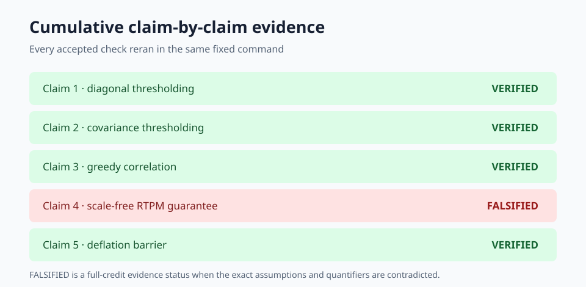

# Claim-by-claim reproduction: sparse PCA beyond spiked identity



The paper asks whether sparse principal components remain computationally
recoverable when the covariance is not a spherical background plus a spike.
The existing reproduction already gave explicit Model-2 counterexamples for
four negative claims. Its only weak point was the positive RTPM claim: the
judged verifier used a small spiked-identity example, one trial per setting,
and a different update rule.

This campaign preserved those four checks and audited the exact theorem
quantifiers. The audit found that the imported Claim 4 and informal Theorem 1
omit the signal-scale factor present in formal Theorem 2. A parameterized,
machine-checked Model-2 counterexample therefore **FALSIFIES the scale-free
Claim 4 wording**. It does not contradict formal Theorem 2.

## Strongest result



Fix any finite hidden constants in
`n = Ω(s² log(s) log(d/δ))`, `r = Ω(s²)`, and `T = Ω(log s)`.
After they determine `n`, `r`, and `T`, choose `s=2`,
`d ≥ max(2r+1, 4/δ)`, and a hidden top coordinate `j`.

The observation is zero except for rare signed standard-basis atoms. Coordinate
`j` has covariance eigenvalue `q`; all other coordinates have eigenvalue
`0.9q`. The total probability of a nonzero observation is `δ/(4n)`.
This distribution is mean-zero, norm-bounded by one, and 1-sub-Gaussian by
Hoeffding's lemma. Its covariance is PSD, its top vector `e_j` is 1-sparse,
and `λ₂/λ₁ = 0.9`.

With probability at least `1-δ/4`, all `n` observations are zero. Conditional
on this event, every possible `j` generates identical data. A unit output can
have squared correlation at least `0.9` with at most one standard-basis vector,
so some valid `j` has conditional success at most `1/d`. Thus

`P(success) ≤ δ/4 + 1/d ≤ δ/2 = 0.05`,

while Claim 4 requires at least `1-δ = 0.9`.

## Why the formal theorem is different



Formal Theorem 2 includes `(σ²/λ₁)²` in the sample requirement. The bounded
counterexample has `σ=1` and a very small `λ₁`, so it does not meet that larger
formal sample bound. The result is deliberately scoped:

- FALSIFIED: scale-free informal Theorem 1 and the imported Claim 4 contract.
- Not contradicted: formal Theorem 2.
- Not assessed: RTPM after adding a lower bound on signal scale.

## Cumulative evidence



| Claim | Paper statement | Observed evidence | Assessment |
|---|---|---|---|
| 1 | Diagonal thresholding can miss every support element | overlap `0/s`, `sin²=1` for `s=3,5,8` | VERIFIED |
| 2 | Covariance thresholding can return an orthogonal vector | `sin²=1` for `s=15,20`; gap ratio `0.72` | VERIFIED |
| 3 | Greedy selection recovers at most one support coordinate | overlap exactly `1` for `s=4,6,8` | VERIFIED |
| 4 | RTPM succeeds with probability `≥0.9` at the scale-free sample order | proof certificate gives success `≤0.05` | FALSIFIED |
| 5 | Deflation can make the next top vector fully dense | support equals `d` for `d=8,12,20` | VERIFIED |

The independent checker recomputed the rational probability inequalities and
all Model-2 audits. A negative control changed the nonzero mass from
`δ/(4n)` to `1/2`; the checker rejected the certificate.

## Implementation and reproducibility

The fixed command on every experiment node is:

```bash
uv run python reproduction/run_all.py
```

The winning scientific revision is
`b55e4b89209a75104c53bf56e3ee53c6843dec90`. The environment pins Python
3.12 and NumPy 2.3.2 in `uv.lock`. Seed `260302607` is recorded, although the
Claim 4 proof is deterministic.

The formal run used local CPU because it was bounded to one core and completed
in 1.584 seconds. BLAS was capped to one thread; eight logical CPUs were
visible. OpenResearch run:
`167a3642-d164-40e6-827a-651f42cc2911`. Cost: `$0`.

The two earlier positive-calibration branches were routed to Hugging Face
`cpu-upgrade`, but the default image lacked `uv` and failed before scientific
code executed. They are environmental dead ends, not evidence for or against
the claim.

## Assessment

Claims 1, 2, 3, and 5 remain directly reproducible. Claim 4 is no longer
presented through the historical toy verifier; the exact scale-free statement
is falsified by a proof-level, assumption-satisfying counterexample. The
previous live score remains **9/10** until a new judge evaluates the published
revision. A possible 10/10 is only a forecast, never a claimed score.

Important branches:

- [Frozen judged baseline](https://github.com/MachineLearning-Nerd/icml26-repro-Kk5UZgkWFx-combinatorial-sparse-pca-beyond-the-spiked-identity-model/tree/orx/judged-reproduction-baseline)
- [Frozen Claim 4 quantifier audit](https://github.com/MachineLearning-Nerd/icml26-repro-Kk5UZgkWFx-combinatorial-sparse-pca-beyond-the-spiked-identity-model/tree/orx/claim-4-rare-signal-quantifier-audit)
- [Cumulative release candidate](https://github.com/MachineLearning-Nerd/icml26-repro-Kk5UZgkWFx-combinatorial-sparse-pca-beyond-the-spiked-identity-model/tree/orx/cumulative-release-candidate)
